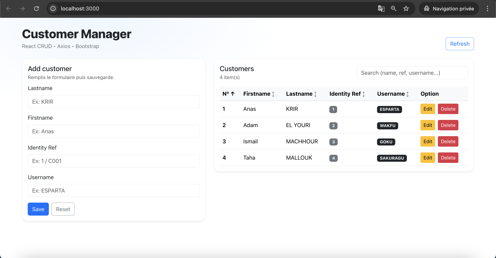
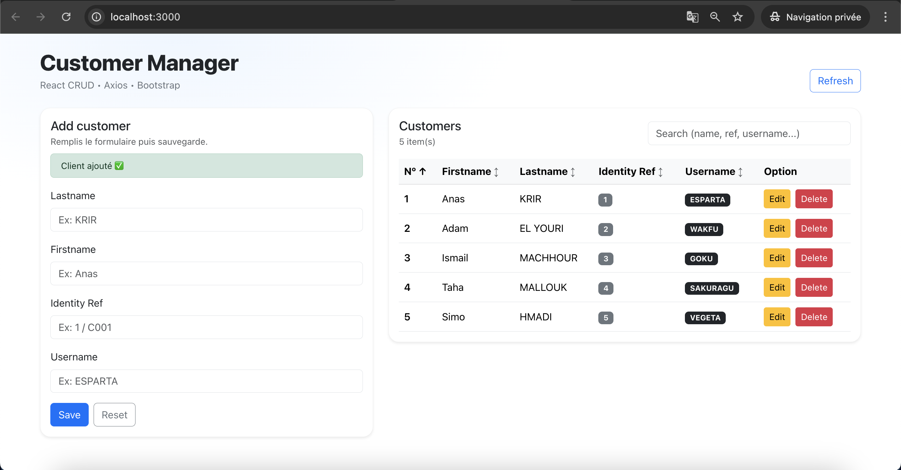
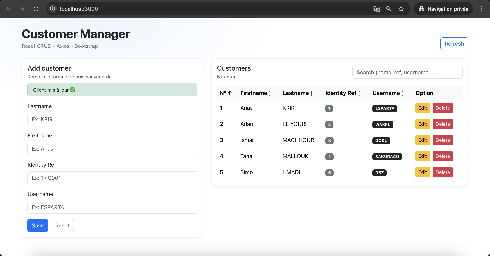
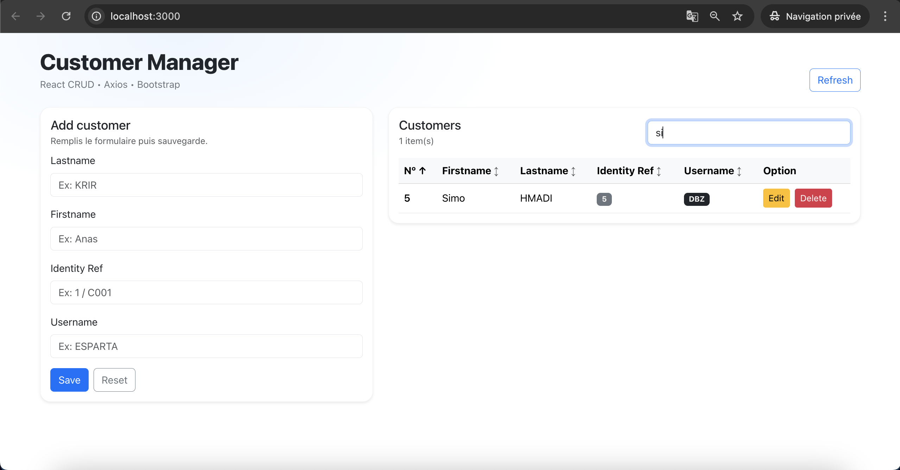
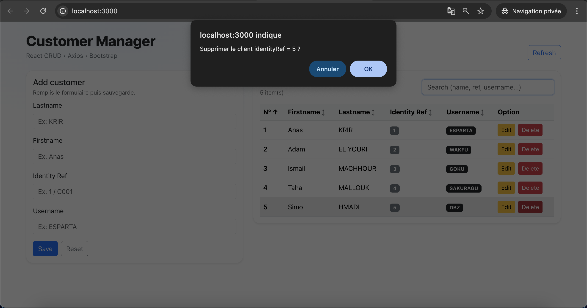
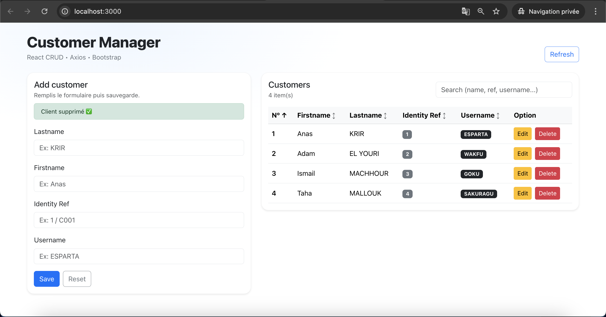

# TP 8 — React CRUD avec Axios & Backend Mock (json-server)


Projet du **TP 8 – Développement d’une application React CRUD**.  
Ce TP a pour objectif de **concevoir une application front-end complète** avec **React**, consommant une **API REST** via **Axios**, et implémentant toutes les opérations **CRUD**.

---

## 📌 Sommaire

1. [Objectifs du TP](#-objectifs-du-tp)
2. [Fonctionnalités](#-fonctionnalités)
3. [Stack technique](#-stack-technique)
4. [Architecture du projet](#-architecture-du-projet)
5. [Backend mock (API REST)](#-backend-mock-api-rest)
6. [Démarrage rapide](#-démarrage-rapide)
7. [Tests & démonstrations](#-tests--démonstrations)
8. [Auteurs](#-auteurs)
9. [Licence](#-licence)

---

## 🎯 Objectifs du TP

- Maîtriser les **fondamentaux de React**
- Implémenter un **CRUD complet**
- Consommer une **API REST** avec **Axios**
- Gérer :
  - États (`useState`)
  - Effets (`useEffect`)
  - Formulaires contrôlés
- Appliquer un **design moderne et responsive**
- Simuler un backend avec **json-server**

---

## ✨ Fonctionnalités

✅ Affichage de la liste des clients  <br/>
✅ Ajout d’un client  <br/>
✅ Modification d’un client  <br/>
✅ Suppression d’un client (confirmation)  <br/>
✅ Recherche dynamique  <br/>
✅ Tri par colonnes  <br/>
✅ Gestion des erreurs réseau  <br/>
✅ Interface responsive (Bootstrap) <br/>
✅ Backend mock REST sur `localhost:8080`  <br/>

---

## 🛠️ Stack technique

| Technologie | Description |
|------------|------------|
| React | Frontend UI |
| Axios | Client HTTP |
| Bootstrap 5 | UI & Responsive |
| Node.js | Runtime |
| json-server | Backend REST mock |
| VS Code | IDE |
| Git / GitHub | Versioning |
| OS | macOS |

---

## 🏗️ Architecture du projet

```
tp1/
├── db.json
├── server.js
├── package.json
├── public/
│
├── src/
│ ├── api/
│ │ └── axiosConfig.js
│ │
│ ├── components/
│ │ ├── CustomerComponent.jsx
│ │ └── CustomerList.jsx
│ │
│ ├── App.js
│ ├── App.css
│ ├── index.js
│ └── index.css
│
├── docs/
│ ├── demo1.png
│ ├── demo2.png
│ └── demo3.png
| └── demo4.png
| └── demo5.png
| └── demo6.png
│
└── README.md
```


---

## 🔌 Backend mock (API REST)

### Le backend est simulé à l’aide de **json-server** et expose les endpoints suivants : <br/>

| Méthode | Endpoint | Description |
|------|---------|------------|
| GET | `/api/rest/customer/all` | Liste des clients |
| POST | `/api/rest/customer/create` | Ajouter un client |
| PUT | `/api/rest/customer/update/{identityRef}` | Modifier un client |
| DELETE | `/api/rest/customer/delete/{identityRef}` | Supprimer un client |

**Le backend tourne sur :**

#### 👉🏻 http://localhost:8080


---

## 🚀 Démarrage rapide

### 1️⃣ Prérequis

✅ Node.js  <br/>
✅ npm  <br/>
✅ Git  <br/>


### 2️⃣ Installation

```
git clone git@github.com:AnasKrir/TP8-React-CRUD.git
cd TP8-React-CRUD
npm install
```

### 3️⃣ Lancer le backend

```
npm run backend
```

**Vérification :** <br/>


```
curl http://localhost:8080/api/rest/customer/all
```

### 4️⃣ Lancer le frontend <br/>

```
npm start
```

**Accès :** <br/>

#### 👉🏻 http://localhost:3000 <br/>

---

## 🔗 Tests & démonstrations

### 🔹 Test 1 — Interface principale

| Interface principale |
| -------------------- |
|   |


#### ➡️ Formulaire + table des clients <br/>


### 🔹 Test 2 — Ajout & modification

| Ajout / Édition     |
| ------------------- |
|  |
|  |


#### ➡️ CRUD complet avec validation <br/>

### 🔹 Test 3 — Recherche, tri & suppression

| Recherche & Delete  |
| ------------------- |
|  |
|  |
|  |


#### ➡️ Recherche dynamique + confirmation de suppression <br/>

---

## 👥 Auteurs

Anas KRIR <br/>
Adam EL YOURI <br/>

Étudiants Ingénieurs — MIAGE <br/>
TP réalisé dans le cadre du module ARCHITECTURE DES COMPOSANTS D'ENTREPRISES <br/>

Technologies : React · Axios · Bootstrap · REST API · CRUD <br/>

---

## 📄 Licence 

✅ Projet sous licence MIT <br/>
Libre d’utilisation, modification et distribution à des fins pédagogiques. <br/>

© 2025 — Anas KRIR & Adam EL YOURI <br/>

---